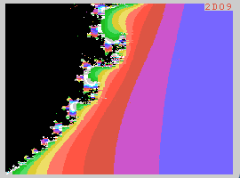

# mandel99
## A fast hi-res Mandelbrot generator for the TI-99/4A

# REQUIREMENTS

- RAM expansion (at least 8 KB). I test with 32 KB.

Note: The stock TI-99/4A comes with only 256 Bytes of RAM (SRAM) that can be directly used by the CPU.  
That's Bytes, not KBytes. It also has 16 KB of Video-RAM, but these cannot be accessed directly by the CPU.
This program is quite small, but needs a little more RAM for temporary buffers used to optimize calculations and rendering.   

# BUILD TYPES

There are two build types:
- "**Benchmark**": This is slightly slower but can be used as a speed benchmark program for your TI-99/4A. When the calculation is completed, the number of elapsed frames is printed in the upper-right corner of the screen (hexadecimal number). The lower the number, the faster the machine.
- "**Fast**": This is about 16% faster. The trick is relocating the core calculation loop in SRAM. Unfortunately, I have not yet found a way to count elapsed frames in this mode without the Console ROM messing with SRAM and destroying my code. So the elapsed frames number will always be 0000.

# CONTROLS

The app is simply controlled using the keyboard.
- Arrows (ESDX): Move around in complex plane.
- Shift + Up (E): Zoom in.
- Shift + Down (X): Zoom out.
- Shift + Left (S): Increase iterations.
- Shift + Right (D): Decrese iterations.

# SUPPORTED RESOLUTIONS
- First pass: 32x24, 16 colors.
- Second pass: 256x192, 16 colors (Graphics II).

# ALGORITHM

### Mandelbrot calculation
This is a fast fixed-point implementation of the Mandelbrot algorithm (see Wikipedia about the Mandelbrot set).  
The TMS9900 processor has integer 16x16-bits multiplication, but lacks support for any floating point math.
This algorithm makes the calculation much faster by using Q6.10 fixed-point math, albeit at the cost of a limited magnification (zoom-in) range. 
The slow part of the calculation consists of two squares and one multiplication per iteration.  
A Q6.10 number uses 6 bits for the signed integer part (5+sign), and 10 bits for the fractional part.  

Note that the code can be optimized further, and will be in future releases.  
Currently, a stock TI-99/4A is be able to render the full set preview (first-pass) in less than 2 seconds, and the full hi-res image in 83 seconds.

### Note about fixed-point precision

There are two different fixed-point notations using "Q" numbers. TI and ARM. I am using ARM notation. More info here:  
https://en.wikipedia.org/wiki/Q_(number_format)  

The current implementation uses Q6.10, so numbers in the range [-32, +32) can be represented.  
The Mandelbrot set is contained in a circle with radius 2. However, during calculation, numbers greater than 2 are encountered, depending on the point being calculated.  
Here is the maximum magnitude reached for each point during the calculation:  

Q5.11 is arguably the best compromise between max-zoom and overflow errors during calculation, however in this version I use Q6.10 to keep the calculation routine size small enough to fit in fast SRAM. A future optimization allowing Q5.11 (hence 2x deeper zoom) is most probably possible.

### Rendering

The rendering is done in two passes:
- First pass is low-res (32x24).
- Second pass is high-res (256x192).

The first pass is low-resolution and serves two purposes:
- Quick preview of rendered image.
- Buffer iterations for second pass optimization.

The second pass is high resolution (well, for an 8-bit machine ;-).
Each low-resolution "big" pixel calculated in the first pass is either left untouched (if all adjacent pixels have the same color) or re-calculated as a 8x8 hi-res tile.
This is particularly useful to skip calculation of parts of the Mandelbrot set (i.e. the black area).

### Hi-res (Graphics II) color clash optimization

Alas, the VDP (Video Display Processor) cannot render independent per-pixel colors in high-res.  
Each block of 8x1 pixels can only have two colors: Foreground and Background.  
This is not as bad as on other computers (e.g. the ZX Spectrum has this limitation for 8x8 pixel blocks), but we still need to optimize the rendering.  

The color clash optimization is as follows:
- Color 0 (transparent) is never used.
- Color 1 (black) is only used for the Mandelbrot set.
- The other 14 colors are re-ordered as a gradient minimizing perceptual difference between adjacent colors. This means adjacent iterations produce similar color shades.
- For each 8x1 block, we calculate the color histogram and find the 2 most used colors to assign to Foreground and Background.
- For each pixel in the 8x1 block, we use the most similar color, either Foreground or Background; i.e. the one with minimum perceptual distance from the actual calculated pixel color.

Q: Doesn't this extra step slow down calculation ?  
A: Yes. However, the result would not be acceptable without it, due to much more visible color errors in busy areas.

# LICENSE

Creative Commons, CC BY

https://creativecommons.org/licenses/by/4.0/deed.en

Please add a link to this github project.
